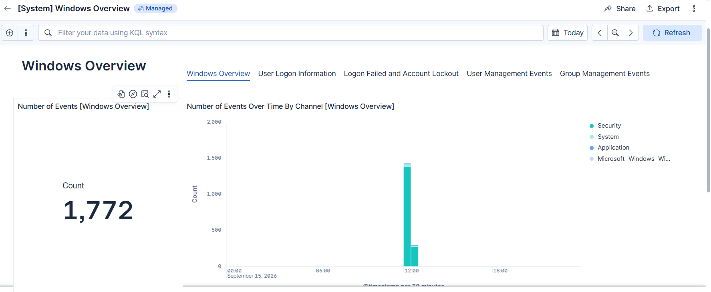
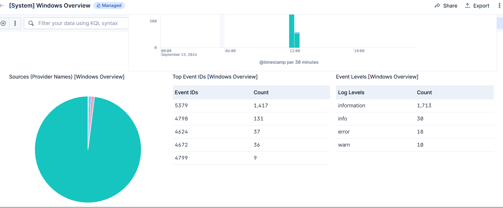
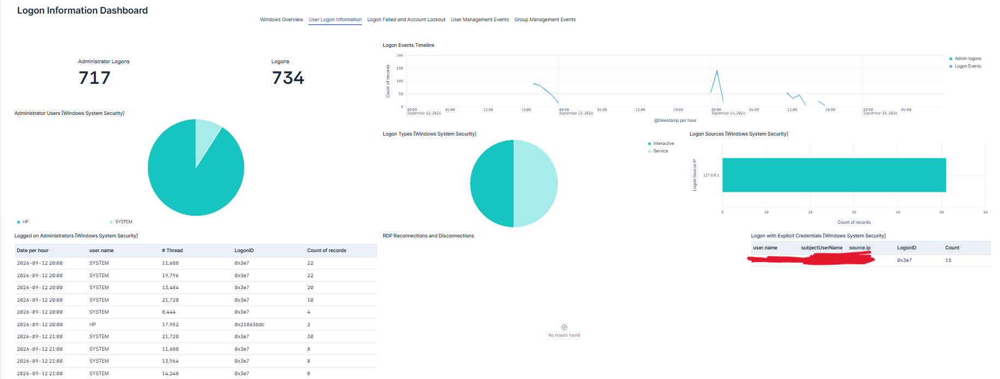

# Mini SOC — Windows Log Monitoring & Alert Detection

## Project Overview

This project demonstrates a beginner-level **Security Operations Center (SOC)** lab using **Windows 11, Elastic Agent, and Elastic Security**.

The project focuses on collecting Windows security logs, monitoring authentication activity, detecting multiple failed login attempts, generating security alerts, and documenting the investigation process.

The main detection scenario is **Windows Event ID 4625 — Failed Logon**.

---

## Project Objective

The main objectives of this project are:

- Collect Windows security logs using Elastic Agent
- Monitor Windows authentication activity
- Detect multiple failed login attempts
- Create a threshold-based detection rule
- Generate and investigate a security alert
- Monitor Windows security activity using dashboards
- Document the incident investigation
- Map the simulated activity to MITRE ATT&CK

---

## Architecture

The project follows this SOC monitoring workflow:

```text
Windows 11 Endpoint
        |
        v
  Elastic Agent
        |
        v
   Elastic Cloud
        |
        +----------------------+
        |                      |
        v                      v
 Elasticsearch             Kibana
                               |
                               v
                       Elastic Security
                               |
                               v
                       Detection Rule
                               |
                               v
                             Alert
                               |
                               v
                         SOC Analyst
```

## Technologies Used

- Windows 11
- Elastic Agent
- Elastic Cloud
- Elastic Security
- Kibana
- Elasticsearch
- Windows Event Viewer
- Windows Security Logs
- VMware Workstation
- Kali Linux
- MITRE ATT&CK

## Detection Scenario

### Windows Event ID 4625 — Failed Logon

Windows Event ID 4625 is generated when an account fails to log on.

For this project, multiple incorrect Windows password attempts were intentionally generated to simulate repeated authentication failures.

## Detection Rule

A threshold-based detection rule was created in **Elastic Security** to detect multiple Windows failed login attempts.

| Configuration | Value |
|---|---|
| Rule Name | Windows Multiple Failed Login Detection |
| Rule Type | Threshold |
| Event ID | 4625 |
| Threshold | 3 events |
| Group By | `host.name`, `user.name` |
| Severity | Low |
| Risk Score | 30 |
| Schedule | Every 1 minute |

The rule generates an alert when **3 or more Event ID 4625 events** are detected for the same host and user.

---

## Test Simulation

The detection rule was tested using the following process:

1. Opened the Windows login screen.
2. Entered an incorrect password multiple times.
3. Windows generated **Event ID 4625**.
4. Elastic Agent collected the security events.
5. Elastic Security received the events.
6. The threshold detection rule evaluated the events.
7. The configured threshold was reached.
8. Elastic Security generated a security alert.
9. The alert was investigated.

### Detection Result

The configured threshold was **3 events**.

During the test, **4 failed login events** were detected.

This successfully triggered the detection rule.

---

## Alert Investigation

The generated alert provided the following information:

| Field | Value |
|---|---|
| Host | `laptop-hda0g1el` |
| User | `HP` |
| Event ID | `4625` |
| Source IP | `127.0.0.1` |
| Logon Type | `2 — Interactive` |
| Detected Count | `4` |
| Severity | Low |
| Risk Score | `30` |

The source IP `127.0.0.1` represents the local machine.

The activity was intentionally generated as part of the cybersecurity lab and was **not a confirmed real-world attack**.

---

## Evidence

All project evidence is stored inside the [`evidence`](evidence/) folder.

### Evidence 3A — Alert Overview


This screenshot shows the generated Elastic Security alert and its main details.

---

### Evidence 3B — Alert Investigation


This screenshot shows the investigation fields associated with the alert.

---

### Evidence 3C — Alert Details


This screenshot provides additional alert investigation evidence.

---

### Windows Overview Dashboard



The Windows Overview dashboard provides visibility into Windows events collected by Elastic Security.

---

### Windows Security Dashboard



This dashboard provides an overview of Windows security-related activity.

---

### Failed & Blocked Accounts Dashboard


This dashboard shows failed authentication activity collected from the Windows endpoint.

The failed logon events include Event ID 4625 activity generated during the project simulation.

---

### User Logons Dashboard



This dashboard provides visibility into Windows user logon activity.

---

## Incident Response

The detected activity was investigated using the following process:

1. Reviewed Windows Event ID 4625 in Windows Event Viewer.
2. Identified the affected user and host.
3. Checked the source IP address.
4. Verified the event in Elastic Security.
5. Investigated the generated detection alert.
6. Confirmed that the configured threshold was exceeded.
7. Verified successful login after the test.
8. Documented the incident.

### Incident Report

Detailed incident documentation is available here:

[View Multiple Failed Logins Incident Report](incident-reports/multiple-failed-logins.md)

---

## MITRE ATT&CK Mapping

### T1110 — Brute Force

The simulated scenario is mapped to:

**T1110.001 — Password Guessing**

This mapping represents the detection scenario used in the lab and does not confirm actual adversary activity.

---

## SOC Workflow

The complete detection workflow demonstrated in this project is:

```text
Failed Windows Login
        |
        v
Event ID 4625 Generated
        |
        v
Elastic Agent Collects Log
        |
        v
Elastic Security Receives Event
        |
        v
Detection Rule Evaluates Event
        |
        v
Threshold Reached
        |
        v
Security Alert Generated
        |
        v
SOC Analyst Investigation
        |
        v
Incident Documentation
```

---

## Key Learnings

Through this project, I gained hands-on experience with:

- Windows Security Event Logs
- Event ID 4625
- Elastic Agent
- Elastic Security
- SIEM log monitoring
- Threshold-based detection
- Alert investigation
- Authentication monitoring
- Basic incident response
- MITRE ATT&CK mapping
- SOC documentation

---

## Future Improvements

The project can be extended by adding:

- Windows PowerShell monitoring
- Windows Defender monitoring
- Sysmon integration
- Account lockout detection
- Suspicious process detection
- PowerShell abuse detection
- Additional SIEM detection rules
- More MITRE ATT&CK mappings
- Automated response actions

---

## Project Structure

```text
Mini-SOC-Windows-Log-Monitoring/
|
+-- architecture/
|   +-- Mini SOC Project Architecture.png
|
+-- evidence/
|   +-- Evidence 3A — Alert Overview.png
|   +-- Evidence 3B — Alert Overview.png
|   +-- Evidence 3C — Alert Overview.png
|   +-- Windowsoverview.png
|   +-- Windowsoverview2.png
|   +-- failed&block accounts.png
|   +-- userlogons.png
|
+-- incident-reports/
|   +-- multiple-failed-logins.md
|
+-- README.md
```

---

## Disclaimer

This project was created for **educational and cybersecurity lab purposes**.

All suspicious activity was intentionally generated on my own Windows endpoint for detection testing. No unauthorized systems or accounts were targeted.
